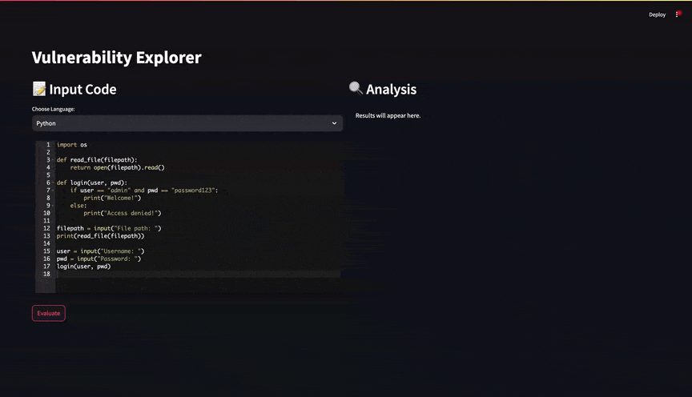

# Vulnerability Explorer

This is a simple web application built with Streamlit that allows users to scan code for vulnerabilities using [Groq](https://groq.com/).



## Prerequisites

- Python 3.10 or higher
- Groq API key

## Installation

1. **Clone the Repository**

   ```bash
   git clone https://github.com/codeguardai/explorer.git
   cd explorer
   ```

2. **Set the Groq API Key**

   ```bash
   export GROQ_API_KEY=<your_api_key_here>
   ```

3. **Install Dependencies**

   ```bash
   pip install -r requirements.txt
   ```

4. **Run the Application**

   ```bash
   streamlit run app.py
   ```

## Usage

1. **Select a Programming Language**: Choose the programming language from the dropdown menu.
2. **Input Your Code**: Write or paste your code into the editor.
3. **Click 'Evaluate'**: The application will analyze your code for vulnerabilities and display the results.


## License

This project is licensed under the Apache License 2.0 License. See the [LICENSE](LICENSE) file for details.
